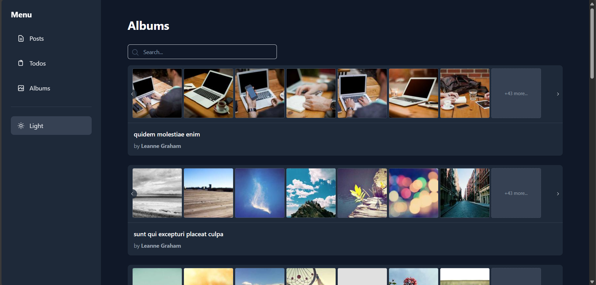

# JSONPlacehorder Dashboard

A modern, responsive, and feature-rich dashboard built with **React**, **Vite**, and **Tailwind CSS** that consumes the [JSONPlaceholder](https://jsonplaceholder.typicode.com/) fake REST API

## ✨ Features

- **Multi-page Dashboard**
  - **Posts**: View, search, and read post details with user info and comments.
  - **Todos**: Interactive todo list with local toggle (completed/active).
  - **Albums**: Browse albums with photo previews and full-screen lightbox.
- **Modern UI/UX**
  - Dark/Light mode toggle (persists in `localStorage`)
  - Responsive sidebar navigation (collapses on mobile)
  - Floating "Back to Top" button
  - Loading spinners & skeleton-like feedback
  - Smooth transitions and hover effects
- **Advanced Interactions**
  - **Search** across all content
  - **Infinite scroll** for albums and photos
  - **Lightbox** with blur backdrop, loading per image
  - **Multi-photo preview** per album with horizontal scroll or navigation buttons
- **Robust Error Handling**
  - Custom **Error Boundary** for unexpected crashes
  - Dedicated **404 Not Found** page
  - API error fallbacks with user-friendly messages

## 🛠️ Tech Stack

- **Framework**: React 18 + Vite
- **Styling**: Tailwind CSS (with Dark Mode)
- **Routing**: React Router v6
- **API**: JSONPlaceholder (fake REST API)
- **Deployment**: Ready for Vercel / Netlify

## 🌐 API Endpoints Used

### Prerequisites

This app consumes the following JSONPlaceholder resources:

| Resource    | Count | Usage                                     |
| ----------- | ----- | ----------------------------------------- |
| `/post`     | 100   | List posts, view details, comments        |
| `/users`    | 10    | Display author info on posts/albums/todos |
| `/todos`    | 200   | Interactive todo list with filters        |
| `/albums`   | 100   | Album list with photo previews            |
| `/photos`   | 5000  | Lightbox view in album detail             |
| `/comments` | 500   | Shown under each post                     |

> "ℹ️ All relations are respected (e.g., `post.userId` -> `user.id`)"
